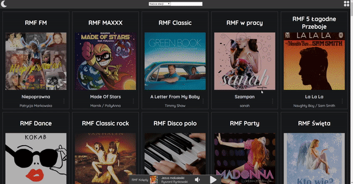

# RMF OFF

DEMO 👉 https://RMFoff.auto200.eu/



Browse and listen to all RMF stations in one place.

### Backend

Written in Express and Socket.io with data from [RMFon](https://www.rmfon.pl/)

### Frontend

ReactJS, Chakra IU, Socket.io

## Setup

Get the code by either cloning this repository using git

```
git clone https://github.com/auto200/RMF-off.git
```

... or [downloading source code](https://github.com/auto200/RMF-off/archive/master.zip) code as a zip archive.

Once downloaded, open the terminal in the project directory, and install dependencies with:

```
yarn install:all
```

Then start the app with:

```
yarn start
```

The app should now be up and running at http://localhost:3000 🚀
